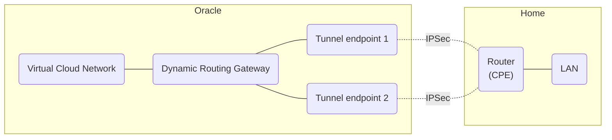
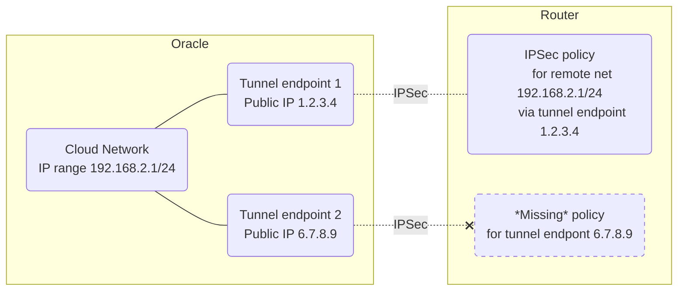

This weekend I figured out how to set up multipath routing with Oracle Cloud's Site-to-Site VPN. I have been using Oracle Cloud for a while as they have a generous "Always Free" plan for their 64-bit ARM virtual servers. To create a site-to-site connection between my home network and the Oracle Cloud network, I use their IPSec Site-to-Site VPN service. This type of VPN is made up of two IPSec tunnels, with different endpoints on the Oracle side, though strangely you can only specify one IP address for the endpoint on your side of the tunnels - Oracle calls this the Customer Premises Equipment or CPE. But in any case, the idea is you establish two tunnels to Oracle for redundancy, even though they both go to one endpoint on the "customer premises".

Traffic between the Virtual Cloud Network (VCN) and the IPSec VPN is routed via a Dynamic Routing Gateway (DRG) in Oracle Cloud. The DRG has internal route tables which it keeps up-to-date with the state of the tunnels - it'll only put an entry in the route tables if the corresponding tunnel is up and running.



When configuring the Site-to-Site VPN I tried to stick to the simplest possible options - just statically define one inner IPv4 and IPv6 network to be routed to each side of the tunnel. I chose the "POLICY" routing option, this means the inner IP ranges are used as part of the IPSec policy on the two endpoints - basically configuring each side so that, if any packets need to be sent to the inner IP ranges designated for the other side of the tunnel, they will be encrypted with IPSec before sending to the outer tunnel endpoint, and likewise packets from the other side will be decrypted. However, I couldn't previously figure out how to get both of the tunnels working simultaneously from the one Linux box I used, to the two Oracle endpoints. When both tunnels were brought up, any communication - even just pinging another server across the VPN - wouldn't work reliably, with long periods of packet loss. It would only work properly with one tunnel in use and the other one "down" and unused.

I revisited this recently, and discovered that part of the problem is that Linux doesn't really support having two IPSec policies in the kernel with the same (inner) source and destination ranges as traffic selectors, only differing in the tunnel outer endpoints used. I'm using [Strongswan](https://www.strongswan.org) for managing the tunnels and associated policies in the kernel, and when it came to installing the policies, whichever tunnel was established first, got its corresponding policy installed, and the tunnel established later just didn't get any corresponding policy in the kernel as one already existed for that inner IP range. I assume this meant that traffic sent from Oracle in the latter tunnel was just getting dropped.



Even more confusingly, and not shown here, there are separate policies for IPv4 and IPv6, so it'd be possible that IPv4 would work over only one tunnel, and IPv6 would only work over the *other* tunnel.

There are some ways to deal with this which are touched on in the [Strongswan documentation](https://docs.strongswan.org/docs/5.9/swanctl/swanctlConf.html#_connections) if you Ctrl-f for "duplicate policies". One approach is to set a Netfilter mark on each policy, meaning the policies are no longer considered "duplicate" if they have different marks. Doing this requires that inbound and outbound packets need to have a matching mark to the corresponding policy in the kernel. This would normally be done using custom `iptables` rules to mark packets matching certain criteria. However, in this case where I have IPv4 and IPv6 tunneled traffic both coming from one Oracle endpoint, but needing different marks to be processed by different policies, I couldn't immediately figure out how to set the right mark on an incoming packet given that it's encrypted at the point it arrives on my router and we need to decide what policy it should be processed by. In theory I might have been able to have just two different marks, one for each endpoint, and apply the same mark to the IPv4 and IPv6 policies for the same endpoint (as they'd be considered unique by the kernel due to the different address families), but I found a probably better way - using xfrm interfaces.

[Xfrm interfaces](https://docs.strongswan.org/docs/5.9/features/routeBasedVpn.html#_xfrm_interfaces_on_linux) are a relatively recent feature in Linux that lets you create virtual interfaces for IPSec traffic, which is similar to how other VPNs like OpenVPN (`tun` interfaces) or WireGuard (`wg` interfaces) work, and more intuitive (to me, at least) than having IPSec traffic "share" the same interface as regular traffic.

> Xfrm is the name used in the Linux kernel for the framework involved in IPSec processing, as it relates to "transforming" packets by encrypting and decrypting them. It also appears in the `iproute2` subcommands used for inspecting IPSec Security Associations and Policies in the kernel: `ip xfrm state` and `ip xfrm policy`.

A simple description of how they work would be: any incoming traffic for an IPSec tunnel with an associated xfrm interface will be decrypted and then appear as if it arrived on the xfrm interface. Any traffic sent to the xfrm interface will be encrypted and sent via the IPSec tunnel. And fortunately, two policies with the same traffic selectors but different xfrm interface IDs are allowed to co-exist.

So, we can have traffic to/from each Oracle IPSec endpoint going via its own xfrm interface. The remaining tasks are getting multipath routing across the two interfaces to work, and failover to the working tunnel if one of the tunnels is down. This can be done with some logic in a custom script that we can get Strongswan to call when the tunnels go up / down.

There seems to be two different ways to set up multipath routing across two devices in Linux (with iproute2). One way is setting multiple "nexthop"s on the route, using the `ip route add $dest nexthop dev $dev1 nexthop dev $dev2` syntax, which I found works for IPv4 but not IPv6, for obscure reasons. The other way is defining the two devices as individual nexthop objects and then creating another nexthop that is actually a group of the two others, and using that as the target for routes, which works both for IPv4 and IPv6. If one of the interfaces that's a nexthop in the group goes down, its nexthop object disappears and is removed from the group. So, we can accomplish the routing and failover as follows:

* when any tunnel transitions from down -> up: try and create/replace and bring up the xfrm interfaces and corresponding nexthops for both tunnels in the pair. Some of those operations might fail if the other tunnel is down, but that's OK - we just add the nexthop(s) corresponding to tunnels that are up to the nexthop group, and use it in the route.
* when any tunnel transitions from up -> down: just mark its corresponding xfrm interface as down. It will be removed from nexthop groups / routes automatically as a result.

There's no cleanup of the created xfrm interfaces there, but that's fine - we expect the tunnels to be permanent and hopefully be up most of the time, and if one goes down, we expect it to be brought back up in the future and re-use the existing xfrm interface, so there's no need to remove the interface.

The logic is complicated by the fact that the IPv4 and IPv6 parts of each tunnel are considered separate entities by Strongswan, so our custom up/down script will be called a total of 4 times when bringing both tunnels up (or down). Taking that into account, we need to define what interfaces (identified by an xfrm interface ID, which is just a number) correspond to which tunnels. This is the scheme I used:

* xfrm interface ID 40 is for Oracle endpoint 1, IPv4
* xfrm interface ID 41 is for Oracle endpoint 2, IPv4
* xfrm interface ID 42 is for Oracle endpoint 1, IPv6
* xfrm interface ID 43 is for Oracle endpoint 2, IPv6

So for multipath routing, interfaces can be considered "pairs" modulo 2, i.e. 40 and 41 are a pair, and likewise for 42 and 43. Having established this, we can identify which pair of interfaces should make up a nexthop group, whenever either of them goes up or down and our custom script is called.

It's also necessary to enable multipath routing in Oracle Cloud - edit the route tables for the VCN and IPSec attachments on the DRG and enable ECMP (Equal Cost Multi Path).

We also need to manage the `iptables` firewall rules to allow traffic over the interfaces - I've made this another function of the custom up/down script. I keep all the IPSec-related rules in three chains, `ipsec_in`, `ipsec_fwd` and `ipsec_out` which are called from the `INPUT`, `FORWARD` and `OUTPUT` chains respectively - to use the up/down script as-is, a similar arrangement of chains is needed, or you can modify the script as needed for your firewall setup. You'll also need rules to allow IKE (UDP port 500) and IPSec (UDP port 4500 and IP protocol ESP) traffic from the Oracle endpoints, for example:

```shell
iptables -A ipsec_in -s <Oracle endpoint 1 public IP>/32 -i <WAN interface> -p udp -m multiport --dports 500,4500 -j ACCEPT
iptables -A ipsec_in -s <Oracle endpoint 1 public IP>/32 -i <WAN interface> -p esp -j ACCEPT
iptables -A ipsec_in -s <Oracle endpoint 2 public IP>/32 -i <WAN interface> -p udp -m multiport --dports 500,4500 -j ACCEPT
iptables -A ipsec_in -s <Oracle endpoint 2 public IP>/32 -i <WAN interface> -p esp -j ACCEPT
```

and similar rules to allow outgoing traffic to the Oracle endpoints if outgoing traffic is also firewalled. The example script below doesn't set up the above WAN interface rules, only the xfrm-interface-related rules.

Here's the custom up/down script including all of the above behaviour:

```shell
#!/bin/sh
# /usr/local/libexec/ipsec_updown.sh - Custom updown script for strongswan
#
# See https://docs.strongswan.org/docs/5.9/plugins/updown.html#_updown_script_interface
# for details of the interface by which this script is called.
#
# define a minimum PATH environment in case it is not set
PATH="/sbin:/bin:/usr/sbin:/usr/bin:/usr/sbin"
export PATH

case "$PLUTO_VERB:$1" in
#
# IPv4 up and down events
#
up-client:)
	# IPv4 connection to my client subnet coming up.
	# Create and bring up xfrm interface. We assume $PLUTO_IF_ID_IN is the same as $PLUTO_IF_ID_OUT
	ifname="xfrm${PLUTO_IF_ID_OUT}"
	# This may fail if the device already exists, which is OK
	ip link add $ifname type xfrm dev $PLUTO_INTERFACE if_id $PLUTO_IF_ID_OUT
	ip link set $ifname up
	# Work out the two interface IDs in this pair:
	idx_in_pair=$(( $PLUTO_IF_ID_OUT % 2 ))
	first_intf=$(( $PLUTO_IF_ID_OUT - $idx_in_pair ))
	second_intf=$(( $first_intf + 1 ))
	nexthop_group=""
	for if_id in $first_intf $second_intf
	do
		# This will fail if the interface is down, in which case we don't add it to the group:
		if ip nexthop replace id $if_id dev "xfrm${if_id}"
		then
			nexthop_group="${nexthop_group}/$if_id"
		fi
	done
	if [ -n "$nexthop_group" ]
	then
		# Create/replace the nexthop group, remembering to strip off the leading slash
		# from the group specifier (due to how we join the group IDs into one string)
		ip nexthop replace id "10$first_intf" group "${nexthop_group:1}"
		# Use the nexthop group as the destination for the route:
		ip route replace $PLUTO_PEER_CLIENT nhid "10$first_intf"
	fi
	# Set up iptables rules to allow forwarding of IPSec traffic between the LAN and Cloud.
	iptables -I ipsec_fwd 1 -o $ifname -p $PLUTO_PEER_PROTOCOL \
			-s $PLUTO_MY_CLIENT \
			-d $PLUTO_PEER_CLIENT \
			-m comment --comment "c_${PLUTO_CONNECTION} uid_${PLUTO_UNIQUEID}" \
			-j ACCEPT
	iptables -I ipsec_fwd 1 -i $ifname -p $PLUTO_MY_PROTOCOL \
			-s $PLUTO_PEER_CLIENT  \
			-d $PLUTO_MY_CLIENT   \
			-m comment --comment "c_${PLUTO_CONNECTION} uid_${PLUTO_UNIQUEID}" \
			-j ACCEPT
	# Allow access to this host via the internal IP:
	iptables -I ipsec_in 1 -i $ifname -p $PLUTO_MY_PROTOCOL \
			-s $PLUTO_PEER_CLIENT \
			-d $PLUTO_MY_CLIENT \
			-m comment --comment "c_${PLUTO_CONNECTION} uid_${PLUTO_UNIQUEID}" \
			-j ACCEPT
	iptables -I ipsec_out 1 -o $ifname -p $PLUTO_PEER_PROTOCOL \
			-s $PLUTO_MY_CLIENT \
			-d $PLUTO_PEER_CLIENT \
			-m comment --comment "c_${PLUTO_CONNECTION} uid_${PLUTO_UNIQUEID}" \
			-j ACCEPT
	;;
down-client:)
	# IPv4 connection to my client subnet going down
	# Bring down xfrm interface
	ifname="xfrm${PLUTO_IF_ID_OUT}"
	ip link set $ifname down
	# Remove iptables rules
	iptables -D ipsec_fwd -o $ifname -p $PLUTO_PEER_PROTOCOL \
			-s $PLUTO_MY_CLIENT \
			-d $PLUTO_PEER_CLIENT \
			-m comment --comment "c_${PLUTO_CONNECTION} uid_${PLUTO_UNIQUEID}" \
			-j ACCEPT
	iptables -D ipsec_fwd -i $ifname -p $PLUTO_MY_PROTOCOL \
			-s $PLUTO_PEER_CLIENT \
			-d $PLUTO_MY_CLIENT \
			-m comment --comment "c_${PLUTO_CONNECTION} uid_${PLUTO_UNIQUEID}" \
			-j ACCEPT
	iptables -D ipsec_in -i $ifname -p $PLUTO_MY_PROTOCOL \
			-s $PLUTO_PEER_CLIENT \
			-d $PLUTO_MY_CLIENT \
			-m comment --comment "c_${PLUTO_CONNECTION} uid_${PLUTO_UNIQUEID}" \
			-j ACCEPT
	iptables -D ipsec_out -o $ifname -p $PLUTO_PEER_PROTOCOL \
			-s $PLUTO_MY_CLIENT \
			-d $PLUTO_PEER_CLIENT \
			-m comment --comment "c_${PLUTO_CONNECTION} uid_${PLUTO_UNIQUEID}" \
			-j ACCEPT
	;;
#
# IPv6 up and down events
#
up-client-v6:)
	# IPv6 connection to my client subnet coming up
	# Create and bring up xfrm interface
	ifname="xfrm${PLUTO_IF_ID_OUT}"
	# This may fail if the device already exists, which is OK
	ip link add $ifname type xfrm dev $PLUTO_INTERFACE if_id $PLUTO_IF_ID_OUT
	ip link set $ifname up
	# Work out the two interface IDs in this pair:
	idx_in_pair=$(( $PLUTO_IF_ID_OUT % 2 ))
	first_intf=$(( $PLUTO_IF_ID_OUT - $idx_in_pair ))
	second_intf=$(( $first_intf + 1 ))
	nexthop_group=""
	for if_id in $first_intf $second_intf
	do
		# This will fail if the interface is down, in which case we don't add it to the group:
		if ip nexthop replace id $if_id dev "xfrm${if_id}"
		then
			nexthop_group="${nexthop_group}/$if_id"
		fi
	done
	if [ -n "$nexthop_group" ]
	then
		# Create/replace the nexthop group, remembering to strip off the leading slash
		# from the group specifier (due to how we join the group IDs into one string)
		ip nexthop replace id "10$first_intf" group "${nexthop_group:1}"
		# Use the nexthop group as the destination for the route:
		ip -6 route replace $PLUTO_PEER_CLIENT nhid "10$first_intf"
	fi
	# Set up iptables rules to allow forwarding of IPSec traffic between the LAN and Cloud.
	ip6tables -I ipsec_fwd 1 -o $ifname -p $PLUTO_PEER_PROTOCOL \
			-s $PLUTO_MY_CLIENT \
			-d $PLUTO_PEER_CLIENT \
			-m comment --comment "c_${PLUTO_CONNECTION} uid_${PLUTO_UNIQUEID}" \
			-j ACCEPT
	ip6tables -I ipsec_fwd 1 -i $ifname -p $PLUTO_MY_PROTOCOL \
			-s $PLUTO_PEER_CLIENT \
			-d $PLUTO_MY_CLIENT \
			-m comment --comment "c_${PLUTO_CONNECTION} uid_${PLUTO_UNIQUEID}" \
			-j ACCEPT
	# Allow access to this host via the internal IP:
	ip6tables -I ipsec_in 1 -i $ifname -p $PLUTO_MY_PROTOCOL \
			-s $PLUTO_PEER_CLIENT \
			-d $PLUTO_MY_CLIENT \
			-m comment --comment "c_${PLUTO_CONNECTION} uid_${PLUTO_UNIQUEID}" \
			-j ACCEPT
	ip6tables -I ipsec_out 1 -o $ifname -p $PLUTO_PEER_PROTOCOL \
			-s $PLUTO_MY_CLIENT \
			-d $PLUTO_PEER_CLIENT \
			-m comment --comment "c_${PLUTO_CONNECTION} uid_${PLUTO_UNIQUEID}" \
			-j ACCEPT
	;;
down-client-v6:)
	# IPv6 connection to my client subnet going down
	# Bring down xfrm interface
	ifname="xfrm${PLUTO_IF_ID_OUT}"
	ip link set $ifname down
	# Remove iptables rules
	ip6tables -D ipsec_fwd -o $ifname -p $PLUTO_PEER_PROTOCOL \
			-s $PLUTO_MY_CLIENT \
			-d $PLUTO_PEER_CLIENT \
			-m comment --comment "c_${PLUTO_CONNECTION} uid_${PLUTO_UNIQUEID}" \
			-j ACCEPT
	ip6tables -D ipsec_fwd -i $ifname -p $PLUTO_MY_PROTOCOL \
			-s $PLUTO_PEER_CLIENT \
			-d $PLUTO_MY_CLIENT \
			-m comment --comment "c_${PLUTO_CONNECTION} uid_${PLUTO_UNIQUEID}" \
			-j ACCEPT
	ip6tables -D ipsec_in -i $ifname -p $PLUTO_MY_PROTOCOL \
			-s $PLUTO_PEER_CLIENT \
			-d $PLUTO_MY_CLIENT \
			-m comment --comment "c_${PLUTO_CONNECTION} uid_${PLUTO_UNIQUEID}" \
			-j ACCEPT
	ip6tables -D ipsec_out -o $ifname -p $PLUTO_PEER_PROTOCOL \
			-s $PLUTO_MY_CLIENT \
			-d $PLUTO_PEER_CLIENT \
			-m comment --comment "c_${PLUTO_CONNECTION} uid_${PLUTO_UNIQUEID}" \
			-j ACCEPT
	;;
*)	echo "$0: unhandled verb \`$PLUTO_VERB' or parameter \`$1'" >&2
	;;
esac
```

The full configuration used for Strongswan is also attached, in case that's useful. The tunnel on the Oracle end has to be configured with the same settings, particularly by enabling Perfect Forward Secrecy using Diffie-Hellman "GROUP5", which corresponds to the "modp1536" group in the Strongswan settings.

```toml
# /etc/swanctl/conf.d/oracle.conf

connections {
	oci-tunnel-1 {
		# Use IKE v2
		version = 2
		# Disable Mobile IKE
		mobike = no
		# Set no limit on retrying key exchanges
		keyingtries = 0
		# If no traffic for 60s, send a dead peer detection 'ping'
		dpd_delay = 60s

		# Set the local and remote tunnel endpoints
		local_addrs = <public IP of our endpoint>
		remote_addrs = <public IP of Oracle endpoint 1>

		# The "Phase 1" encryption algorithms and lifetime can be customised, but this is the Oracle default:
		proposals = aes256-sha2_384-ecp384
		rekey_time = 28800s

		children {
			oci-tunnel-1-ipv4 {
				start_action = start
				mode = tunnel

				# This is the default encryption algorithm, with perfect forward secrecy
				# using Diffie-Hellman "GROUP5" in the Oracle settings:
				esp_proposals = aes256gcm16-modp1536

				# This is the xfrm interface ID to use for this tunnel:
				if_id_in = 40
				if_id_out = 40

				# These are the traffic selectors to be used in the policy:
				local_ts = <local LAN CIDR block e.g. 192.168.1.0/24>
				remote_ts = <remote cloud network CIDR block e.g. 192.168.2.0/24>

				# If dead peer detection flags the other end as 'dead', try restarting the tunnel
				dpd_action = restart

				# The custom script which controls the IPSec interfaces
				updown = /usr/local/libexec/ipsec_updown.sh

				# Allow access to the router itself via the tunnel
				hostaccess = yes
			}
			oci-tunnel-1-ipv6 {
				# The configuration here is very similar to above, except for IPv6 rather than IPv4
				start_action = start
				mode = tunnel
				esp_proposals = aes256gcm16-modp1536
				if_id_in = 42
				if_id_out = 42
				local_ts = <local LAN CIDR block e.g. 2002:f00f::/48>
				remote_ts = <remote cloud network CIDR block e.g. 2603:f00f::/56>
				dpd_action = restart
				updown = /usr/local/libexec/ipsec_updown.sh
				hostaccess = yes
			}
		}
		# Use a pre-shared key (defined at the end of this file) for local and remote authentication:
		local-0 {
			auth = psk
			id = <public IP of our endpoint>
		}
		remote-0 {
			auth = psk
			id = <public IP of Oracle endpoint 1>
		}
	}
	# The configuration below is very similar to above, just for the second tunnel / Oracle endpoint:
	oci-tunnel-2 {
		version = 2
		mobike = no
		keyingtries = 0
		rekey_time = 28800s
		remote_addrs = <public IP of Oracle endpoint 2>
		local_addrs = <public IP of our endpoint>
		proposals = aes256-sha2_384-ecp384
		dpd_delay = 60s
		children {
			oci-tunnel-2-ipv4 {
				start_action = start
				esp_proposals = aes256gcm16-modp1536
				mode = tunnel
				if_id_in = 41
				if_id_out = 41
				local_ts = <local LAN CIDR block e.g. 192.168.1.0/24>
				remote_ts = <remote cloud network CIDR block e.g. 192.168.2.0/24>
				dpd_action = restart
				updown = /usr/local/libexec/ipsec_updown.sh
				hostaccess = yes
			}
			oci-tunnel-2-ipv6 {
				start_action = start
				esp_proposals = aes256gcm16-modp1536
				mode = tunnel
				if_id_in = 43
				if_id_out = 43
				local_ts = <local LAN CIDR block e.g. 2002:f00f::/48>
				remote_ts = <remote cloud network CIDR block e.g. 2603:f00f::/56>
				dpd_action = restart
				updown = /usr/local/libexec/ipsec_updown.sh
				hostaccess = yes
			}
		}
		local-0 {
			auth = psk
			id = <public IP of our endpoint>
		}
		remote-0 {
			auth = psk
			id = <public IP of Oracle endpoint 2>
		}
	}
}
secrets {
	ike-tunnel-1-psk {
		secret = <PSK for tunnel 1, e.g "xxxyyyzzz">
		id-0 = <public IP of our endpoint>
		id-1 = <public IP of Oracle endpoint 1>
	}
	ike-tunnel-2-psk {
		secret = <PSK for tunnel 2, e.g "xxxyyyzzz">
		id-0 = <public IP of our endpoint>
		id-1 = <public IP of Oracle endpoint 2>
	}
}
```
Using this setup I've observed a stable connection to Oracle with both tunnels running and carrying traffic, when previously I could only have one tunnel running at any time.